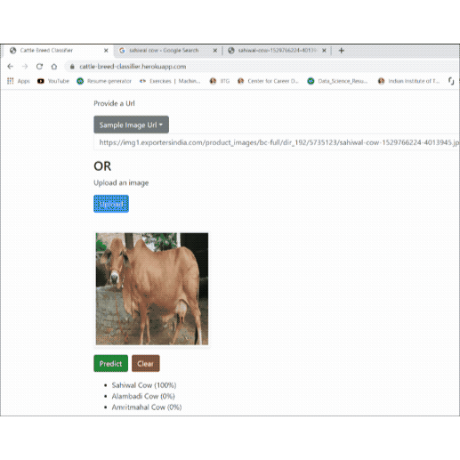

# 🐄 Indigenous Cattle Breed Classifier

[](https://www.python.org/)
[](https://pytorch.org/)
[](https://flask.palletsprojects.com/)
[](LICENSE)

A deep learning-powered web application that identifies indigenous cattle breeds from images. Built with PyTorch and Flask, this tool helps farmers, veterinarians, and cattle enthusiasts quickly determine the breed of a cow or buffalo.

---

## 📸 Live Demo



---

## ✨ Features

- **Upload or URL-based classification** — Submit an image file or provide a URL
- **Top-3 breed predictions** — Returns the most likely breeds with confidence scores
- **REST API** — Clean JSON API for integration into other applications
- **Responsive web UI** — Works on desktop and mobile browsers
- **Auto-downloads model on startup** — No manual model setup required
- **Production-ready server** — Gunicorn/Uvicorn ready with caching headers

---

## 🏗️ Architecture

```
┌─────────────────────────────────────────────────────────┐
│                     Web Interface                        │
│  (Bootstrap UI, image upload / URL input, preview)      │
└─────────────────────┬───────────────────────────────────┘
                      │
                      ▼
┌─────────────────────────────────────────────────────────┐
│                    Flask Application                     │
│  ┌─────────────┐  ┌─────────────┐  ┌─────────────────┐  │
│  │ /api/       │  │ /api/       │  │ /ping  │ /config │  │
│  │ classify    │  │ classes     │  │        │         │  │
│  └─────────────┘  └─────────────┘  └─────────────────┘  │
└─────────────────────┬───────────────────────────────────┘
                      │
                      ▼
┌─────────────────────────────────────────────────────────┐
│                PyTorch Inference Engine                  │
│  ┌─────────────────────────────────────────────────────┐│
│  │  ResNet-18  →  Transform (224×224, normalize)      ││
│  │  Softmax → Top-N predictions with probabilities     ││
│  └─────────────────────────────────────────────────────┘│
└─────────────────────────────────────────────────────────┘
```

---

## 🧠 Model

| Detail            | Value                                                                 |
| ------------------ | --------------------------------------------------------------------- |
| **Architecture**   | ResNet-18 (ImageNet pretrained weights, custom classifier head)      |
| **Input size**     | 224 × 224 pixels (RGB)                                               |
| **Number of classes** | 26 Indian cattle breeds                                              |
| **Training dataset** | Indian-Cattle-Breed-Images (~4,000 images, ~150 per breed)         |
| **Training platform** | Google Colab (NVIDIA Tesla K80, 12 GB GPU)                         |
| **Training time**  | ~30 minutes                                                           |
| **Framework**      | PyTorch 1.11+, torchvision 0.12+                                      |

### Supported Breeds

The model recognizes **26 popular Indian cattle breeds**, including:

- **Gir Cow** — A famous dairy breed from Gujarat
- **Sahiwal Cow** — High-yielding dairy breed from Punjab/Pakistan
- **Dangi Cow** — Dual-purpose breed from Maharashtra
- **Mehsana Buffalo** — Dairy buffalo breed from Gujarat
- *(and 22 more indigenous breeds)*

> 🔍 Full list of classes is available at runtime via `GET /api/classes`.

---

## 📦 Installation

### Prerequisites

- Python 3.8 or higher
- pip (or pipenv/conda)

### Step 1 — Clone the repository

```bash
git clone https://github.com/sajit9285/cattle-breed-classifier-webapp.git
cd cattle-breed-classifier-webapp
```

### Step 2 — Create a virtual environment (recommended)

```bash
python3 -m venv venv
source venv/bin/activate        # On Windows: venv\Scripts\activate
```

### Step 3 — Install dependencies

```bash
pip install -r requirements.txt
```

### Step 4 — Prepare the `models/` directory

The application downloads the model and class labels from Google Drive on first run. To pre-populate:

```bash
mkdir -p models
```

The model file (`cattle_breed_classifier_full_model.pth`) and `classes.txt` will be downloaded automatically when the app starts.

---

## 🚀 Running the Application

### Local development

```bash
python app.py
```

The app starts on `http://0.0.0.0:5001` by default. Open the URL in your browser.

### Production deployment (Gunicorn)

```bash
gunicorn --bind 0.0.0.0:5001 --workers 4 app:app
```

### Production deployment (Uvicorn, async)

```bash
uvicorn app:app --host 0.0.0.0 --port 5001 --workers 4
```

### Environment variables

| Variable | Default | Description                          |
| --------- | ------- | ------------------------------------ |
| `PORT`    | `5001`  | Port the server listens on           |

---

## 🌐 API Documentation

### Base URL

```
http://localhost:5001
```

### Endpoints

#### `POST /api/classify` — Classify an uploaded image

Upload an image file using `multipart/form-data`.

**Request**

```bash
curl -X POST http://localhost:5001/api/classify \
  -F "file=@/path/to/cow_image.jpg"
```

**Response (200 OK)**

```json
{
  "class": "Gir_Cow",
  "predictions": [
    { "class": "Gir Cow",   "output": 8.2, "prob": 0.87 },
    { "class": "Sahiwal Cow", "output": 3.1, "prob": 0.10 },
    { "class": "Dangi Cow",  "output": 1.5, "prob": 0.03 }
  ]
}
```

| Field       | Type   | Description                                      |
| ----------- | ------ | ------------------------------------------------ |
| `class`     | string | The top-predicted breed (underscore-separated)   |
| `predictions` | array | Top-3 predictions sorted by output score         |
| `predictions[].class` | string | Breed name (human-readable)           |
| `predictions[].output` | number | Raw model output logit                |
| `predictions[].prob`   | number | Probability (0–1)                     |

---

#### `GET /api/classify?url=<image_url>` — Classify an image from URL

Provide an image URL as a query parameter.

**Request**

```bash
curl "http://localhost:5001/api/classify?url=https://example.com/cow.jpg"
```

**Response** — Same JSON structure as the POST endpoint.

---

#### `GET /api/classes` — List all recognized breeds

Returns the full list of breed class names.

**Request**

```bash
curl http://localhost:5001/api/classes
```

**Response (200 OK)**

```json
[
  "Gir_Cow",
  "Sahiwal_Cow",
  "Dangi_Cow",
  "Mehsana_Buffalo",
  "... (26 total)"
]
```

---

#### `GET /ping` — Health check

Used by load balancers / monitoring tools.

**Request**

```bash
curl http://localhost:5001/ping
```

**Response**

```
pong
```

---

#### `GET /config` — Application configuration

Returns the contents of `config.yaml`.

**Request**

```bash
curl http://localhost:5001/config
```

---

## 🗂️ Project Structure

```
cattle-breed-classifier-webapp/
├── app.py                  # Main Flask application & inference logic
├── config.yaml             # App metadata (title, description, sample images)
├── requirements.txt        # Python dependencies
├── Procfile                # Heroku/Render process declaration
├── .gitignore              # Git ignore rules
├── LICENSE                 # MIT License
│
├── src/                    # Training & evaluation source code
│   ├── model.py            # ResNet-50 model builder
│   ├── train.py            # Training script
│   ├── evaluate.py         # Model evaluation script
│   └── dataset_loader.py   # PyTorch DataLoader for image folders
│
├── templates/
│   └── index.html          # Web UI (Bootstrap + vanilla JS)
│
├── static/
│   ├── style.css           # Custom CSS (gradient backgrounds, cards)
│   ├── css/               # Additional stylesheets
│   └── js/                # Additional JavaScript
│
├── docs/
│   ├── 1_training.md       # Model training documentation
│   └── 2_render_app.md     # Render deployment guide
│
├── notebooks/
│   ├── Indigenous_Cattle_Breed_Classifier.ipynb     # EDA & training notebook
│   └── Indigenous_Cattle_Breed_Classifier_Old_Version.ipynb
│
├── assets/
│   ├── demo.gif            # Application demo animation
│   └── 00000008.jpg        # Sample asset image
│
└── models/                 # (auto-created) Downloaded model & class labels
    ├── cattle_breed_classifier_full_model.pth
    └── classes.txt
```

---

## 🧪 Training Your Own Model

If you want to retrain the model on a different dataset:

### 1. Prepare your data

Organize images into a folder structure where each subfolder is a breed class:

```
Cattle_Resized/
├── Gir_Cow/
│   ├── img1.jpg
│   └── img2.jpg
├── Sahiwal_Cow/
│   ├── img1.jpg
│   └── img2.jpg
└── ...
```

### 2. Train the model

```bash
python src/train.py
```

Edit `src/train.py` to set your `data_dir` and `num_classes`:

```python
model = train_model(
    data_dir='/path/to/Cattle_Resized',
    num_classes=26,        # number of breed folders
    num_epochs=25,
    batch_size=8,
    learning_rate=0.001
)
torch.save(model.state_dict(), 'cattle_breed_classifier.pth')
```

### 3. Evaluate the model

```bash
python src/evaluate.py
```

### 4. Export for the web app

The web app expects a `.pth` file containing a dictionary with a `"state_dict"` key and a `classes.txt` file with comma-separated breed names. Upload these to Google Drive (or host them elsewhere) and update the URLs in `app.py`:

```python
export_file_url = 'https://your-host.com/path/to/model.pth'
export_file_name = 'cattle_breed_classifier_full_model.pth'
export_classes_url = 'https://your-host.com/path/to/classes.txt'
export_classes_name = 'classes.txt'
```

---

## ☁️ Deployment

### Render (recommended)

1. Push your code to GitHub
2. Create a new **Web Service** on [Render](https://render.com/)
3. Connect your GitHub repository
4. Set the build command: `pip install -r requirements.txt`
5. Set the start command: `gunicorn --bind 0.0.0.0:$PORT app:app`
6. Deploy!

Full guide: see [`docs/2_render_app.md`](docs/2_render_app.md)

### Heroku

The repository includes a `Procfile`:

```
web: gunicorn --bind 0.0.0.0:$PORT app:app
```

Deploy as usual with the Heroku CLI.

### Docker

A `Dockerfile` is not included, but you can create one:

```dockerfile
FROM python:3.9-slim

WORKDIR /app

COPY requirements.txt .
RUN pip install --no-cache-dir -r requirements.txt

COPY . .

RUN mkdir -p models

EXPOSE 5001

CMD ["gunicorn", "--bind", "0.0.0.0:5001", "app:app"]
```

Build and run:

```bash
docker build -t cattle-classifier .
docker run -p 5001:5001 cattle-classifier
```

---

## 🌐 Environment Variables for Deployment

When deploying to a cloud platform (Render, Heroku, etc.):

| Variable | Purpose                                |
| --------- | -------------------------------------- |
| `PORT`    | Set by the platform; the app reads it  |

No other environment variables are required — the model downloads automatically.

---

## ⚠️ Known Limitations

1. **Model download on startup** — The first request after a fresh deploy will be slow while the model downloads ~100 MB+ from Google Drive. Consider pre-baking the model into the container for faster cold starts.
2. **No authentication** — The API is open; add rate limiting / auth for production use.
3. **Input validation** — The app does not restrict file size or image dimensions. Add middleware if needed.
4. **URL-based classification** — Makes an outbound HTTP request to fetch the image; ensure outbound network access is allowed in your deployment environment.

---

## 🤝 Contributing

Contributions are welcome!

1. Fork the repository
2. Create your feature branch (`git checkout -b feature/amazing-feature`)
3. Commit your changes (`git commit -m 'Add amazing feature'`)
4. Push to the branch (`git push origin feature/amazing-feature`)
5. Open a Pull Request

Please ensure any new dependencies are added to `requirements.txt` and that the app still starts cleanly.

---

## 📚 References

- **PyTorch** — https://pytorch.org/
- **ResNet paper** — [Deep Residual Learning for Image Recognition](https://arxiv.org/abs/1512.03385) (He et al., 2015)
- **Training notebook** — [`notebooks/Indigenous_Cattle_Breed_Classifier.ipynb`](notebooks/Indigenous_Cattle_Breed_Classifier.ipynb)
- **Dataset** — Indian-Cattle-Breed-Images (Google Drive)

---

## 📄 License

This project is licensed under the **MIT License** — see the [`LICENSE`](LICENSE) file for details.

---

## 👨‍💻 Author

Built by **[Ajit Kumar Singh](https://sajit9285.github.io/myportfolio)** — Data Scientist & Deep Learning enthusiast.

- **Blog**: https://sajit9285.github.io/myportfolio
- **Original web app**: https://cattle-breed-classifier.herokuapp.com
- **Source code**: https://github.com/sajit9285/cattle-breed-classifier-webapp

> Made with ❤️ for farmers and cattle enthusiasts.

---

*Built with PyTorch, Flask, and Bootstrap.*
